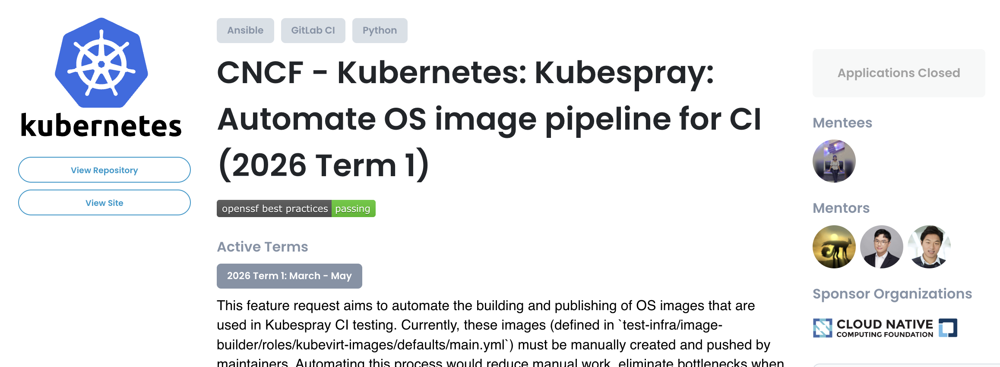
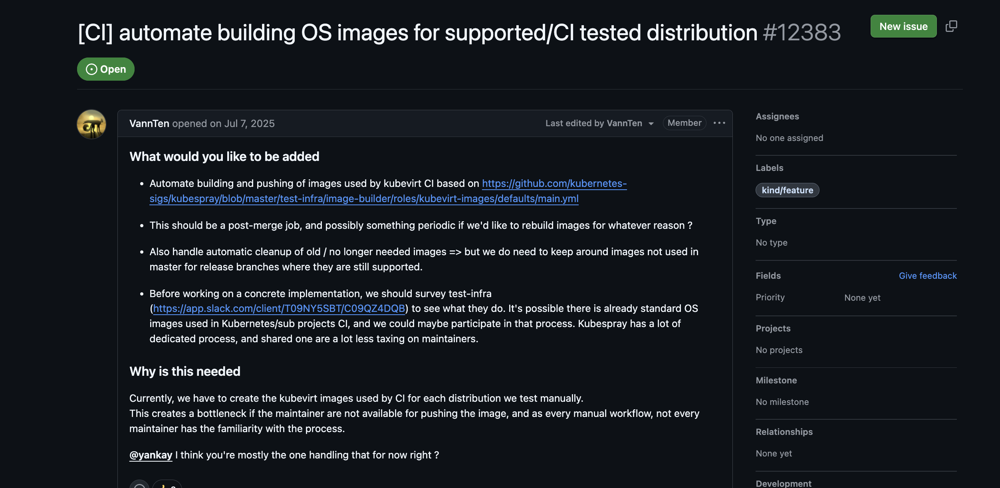

## My LFX Mentorship Journey with CNCF - Kubernetes: Kubespray

*3 months of CI debugging, Kubernetes infrastructure, and learning how real open source collaboration works.*

### What is LFX Mentorship?

The [LFX Mentorship Program](https://lfx.linuxfoundation.org/tools/mentorship/) helps contributors work with open source communities under the guidance of experienced mentors.

I got selected to work with [Kubespray](https://github.com/kubernetes-sigs/kubespray), a Kubernetes SIG Cluster Lifecycle project used to deploy production-ready Kubernetes clusters.




When I started, I knew I would be working around CI and image automation, but I did not fully know how much I would learn about Kubernetes infrastructure, Prow, test-infra, Cloud Build, registries, and community coordination.

In Kubernetes, many areas are organized through SIGs, or Special Interest Groups. A SIG is a group of contributors and maintainers focused on a specific part of the project.
For this work, I interacted mostly with two SIGs:

- [SIG Testing](https://github.com/kubernetes/community/tree/master/sig-testing), which helps maintain Kubernetes testing infrastructure such as Prow jobs and CI workflows.
- [SIG K8s Infra](https://github.com/kubernetes/community/tree/master/sig-k8s-infra), which helps manage Kubernetes project infrastructure such as registries, credentials, and community-owned cloud resources.

### Why Kubespray?

I wanted to work on a project where I could learn how real production-grade open source infrastructure is maintained.

Kubespray was interesting to me because it is part of the Kubernetes ecosystem and is used for deploying Kubernetes clusters. The project I worked on was not just about writing code. It involved CI jobs, image building, registry publishing, and coordination across multiple Kubernetes repositories.

The main issue I worked around was:



The goal was to automate building and publishing OS images used by Kubespray’s KubeVirt CI.

### Project Goal

The broader goal was to improve the Kubespray image-builder flow.

There were two main parts:

1. Validate image-builder changes safely in presubmit jobs.
2. Move toward a postsubmit job that can build and push images automatically.

### The Presubmit Puzzle
The first part was presubmit validation.

The existing flow depended on SSH access to a remote builder host. That was not suitable for Prow CI, because the job environment could not reliably access that remote host.

So the idea was to make validation run locally in CI.
At first, the change looked straightforward: run the image-builder locally and avoid pushing images. But in CI, every small assumption gets tested very quickly.

### More Research Than Lines of Code

One thing I realized during this project is that infrastructure work often needs more research and discussion than just adding lines of code.
At different points, we changed direction based on what we learned.

Initially, we discussed a few possible image publishing paths, including [Quay.io](https://quay.io/) and the [GitHub Container Registry](https://docs.github.com/en/packages/working-with-a-github-packages-registry/working-with-the-container-registry) (`ghcr.io`).

`ghcr.io` looked like one possible option, but after discussing the end-to-end CI flow with my mentors, it did not seem like the best fit. This work needed to fit into Kubernetes Prow/test-infra infrastructure, not just provide a place to store images.

`Quay.io` was already used in the existing manual flow, so we considered keeping it. But automating Quay pushes would require a robot token and secret handling in CI, which made us look more carefully at the safest registry path.

But then another problem became clear: the existing validation flow depended on a remote builder host, and that required credentials and network access that were not suitable for the Prow presubmit environment.

So the next question became: can we use a build tool that does not require a Docker daemon, remote builder access, or extra privileges?

My mentor pointed out that Kubespray already had a related pattern in `.gitlab-ci/build.yml`, where `moby/buildkit:rootless` was being used successfully. BuildKit rootless looked like a good direction because it could avoid relying on another builder and also avoid needing a Docker daemon.

That shifted the work toward BuildKit.

At first, it felt like the right path. But once I started testing it in Prow, the CI environment revealed more constraints. Each time one issue was fixed, the job progressed further and exposed the next blocker.

Some of the failures were:

- `qemu-img` was not available in the job image.
- `buildctl-daemonless.sh` was missing.
- BuildKit binaries were not installed.
- Rootful BuildKit failed with mount permission errors.
- Rootless BuildKit needed user namespaces, but the node had them disabled.

The final blocker was:
```markdown
> user namespaces are disabled on this node; rootless BuildKit cannot run
```

*I thought I was fixing a missing package 🥲. CI said: "actually, let’s talk about kernel user namespaces".*


That error was important because it showed that the problem was not just missing packages anymore. It was a limitation of the current Prow node environment.


At this point, I asked in SIG Testing to understand whether user namespaces could be enabled, or whether there was a supported node pool for this kind of workload. The discussion helped clarify that this was not something we should try to force immediately. The sig-Tesing Folks suggested that User namespace support is available in `Kubernetes v1.36`. [Kubernetes user namespaces documentation](https://kubernetes.io/docs/concepts/workloads/pods/user-namespaces/)

However, the current CI environment was not yet updated in a way that made user namespaces available for our use case, so rootless BuildKit remained blocked there.

So after all that research, testing, and discussion, we moved to `Docker-in-Docker` for the presubmit path.

Docker-in-Docker was not the original plan. It was the practical path that fit the current CI environment and allowed us to validate the real image build flow end-to-end.

This part of the project taught me something important: sometimes the final code change looks small, but the reasoning behind it is the real work.

### Docker-in-Docker for Now
Docker-in-Docker was not the “perfect” solution, but it was the practical one for this lane.
So the presubmit flow became:

```markdown
before merge
-> presubmit runs
-> image is downloaded
-> checksum is verified
-> image is converted/resized
-> Docker image is built locally
```

This gave us real build validation without needing registry credentials.

After the presubmit started working, I tested whether it actually caught problems.
And yes, it was working. 

*That small moment when CI finally fails for the right reason.*


### Moving to Postsubmit
After presubmit validation, the next step was postsubmit publishing.

The target flow was:
```markdown
master merge
-> postsubmit
-> Cloud Build
-> build/push ubuntu-2404 canary image
-> publish to Kubespray staging OCI registry
```

Initially, we discussed pushing to Quay.io, because Kubespray already had image publishing there. But this raised questions about robot accounts and registry credentials.

After discussion with SIG Testing and SIG K8s Infra, we decided to use the Kubernetes `community-owned OCI` staging registry instead of introducing a new Quay credential path.This felt like a better long-term direction because it follows Kubernetes infrastructure patterns.

For the staging registry, I worked across the `k8s.io` repository. After the required infrastructure changes were merged, the community-owned OCI staging path became available for the Kubespray image-builder postsubmit flow.

After that, I added the Kubespray-side staging publish target and the related test-infra postsubmit job. These changes still need review and testing, but they complete the initial end-to-end path for building and pushing the one canary image.

### Community Experience
One of the best parts of this mentorship was the community.

I am very thankful to my mentors, [Max Gautier](https://github.com/VannTen), [ChengHao Yang](https://github.com/tico88612), and [Kay Yan](https://github.com/yankay), for guiding me throughout the program with reviews, debugging, and project direction. Their support made the project feel much more approachable and helped me stay consistent even when the CI failures were confusing.

People from SIG Testing and SIG K8s Infra were very helpful too. Even when I asked basic questions about Prow, user namespaces, or registry credentials, they explained the context and helped me understand the right path.

This is one of the things that makes me excited to keep contributing to open source. The code matters, but the people and discussions around the code matter just as much.

*I am really happy to be part of this community, and I am grateful for everything I learned during this journey.*

